## SDC - Project 5 [(Video)](https://www.youtube.com/watch?v=CKhCfjDUAoo)
### Report

---

## Vehicle Detection Project

The objective of this project is to build an image processing pipeline to detect vehicles and their respective positions in images (and videos) by training a machine learning model/classifier with a dataset of labeled examples of vehicles and non vehicles.

The steps involved with the vehicle detection pipeline are as follows:

* Preprocess the data and extract features from the images. Three sets of feature extraction methods have been explored based on the following:
  * Color histograms
  * Spatial Binning
  * Histogram of Oriented Gradients (HOG)


* Using these feature vectors for each labeled image in the dataset, I created training and testing sets, and trained a binary classifier.

* Further, I implemented a sliding-window technique and used the trained classifier to search for vehicles in patches/small-windows of images.

* Using the detected bounding box positions of the vehicles at each sliding window scale size, I created a heat map to represent overlapping detections based on different sliding window scale sizes. The primary objective of using the heat map is to reject false positive detections based on thresholding the number of overlapping detections.

* Using the maximum and minimum positions of the overlapping bounding boxes in the heat map, the final bounding boxes of the vehicles are estimated and drawn on the image/frame of the video.

* This frame-based pipeline is then applied to a video to detect vehicles in a video stream.

---

## Code Structure Overview


The code for this project is distributed into three main files:
* `image_processor.py`: Defines the `ImageProcessor` class which takes an image and processes it for both the training phase and the object detection phase. It defines methods such as `extract_color_histogram_features`,`extract_bin_spatial`, `extract_hog_features`, `find_cars` and many more which collectively work to extract features and find cars (using a trained classifier).

* `vehicle_detection.py`: Defines the `VehicleDetectionPipeline` class which runs on multiple images or frames of a video. It creates an instance of the `ImageProcessor` class for every image/frame and is responsible for using features extracted (via `ImageProcessor`'s instance method) to train a binary vehicle classifier. It also maintains temporal information by holding a reference to the previously processed frame while tracking the next frame.

* `P5.ipynb`: This notebook is used to run the pipeline on the images/videos for the project and provide and output for different steps of the pipeline.


## [Rubric Points](https://review.udacity.com/#!/rubrics/513/view)


* I started by reading in all the `vehicle` and `non-vehicle` images.  Here is an example of one of each of the `vehicle` and `non-vehicle` classes:

<p align="center">
  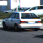  
  <p align="center">Image from the 'Car' class</p>
</p>

<p align="center">
  
  <p align="center">Image from the 'Not Car' class</p>
</p>

* These images were then processed to create the feature vectors for every image and create the training dataset of feature vectors.

* I extracted features based on color histograms for each channel of the image and concatenated all these histogram arrays to create a feature vector for the image. For the underlying color spaces of the image channels, I explored using the RGB and YCrCb color spaces. Experimenting with the two color spaces, I found that YCrCb provided a more robust representation of image for the color-histograms and by extension resulted in a better classifier that could more accurately classify images as having a car or not.

<p align="center">
  
  <p align="center">Sample car training image in YCrCb Color Space</p>
</p>

<p align="center">
  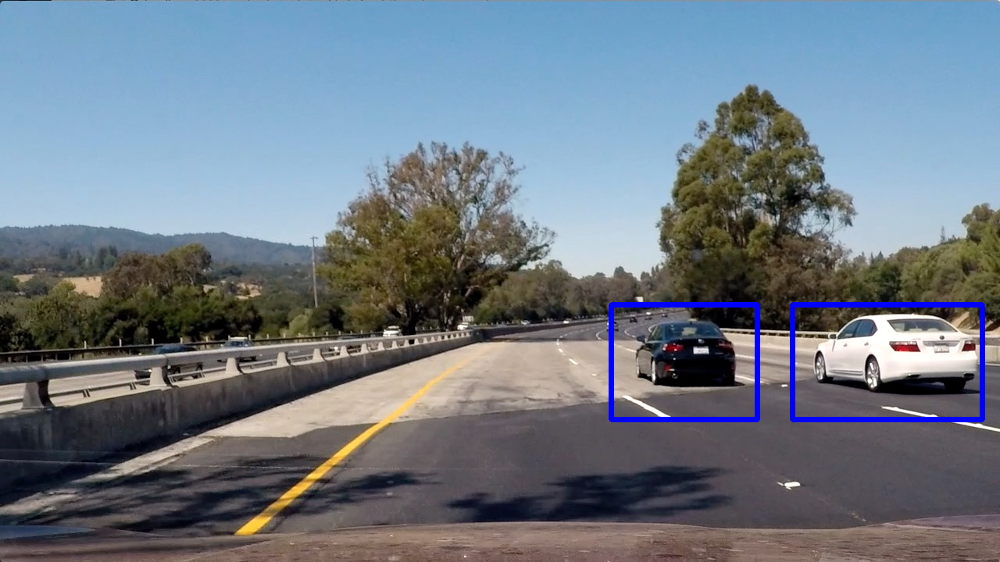
  <p align="center">Sample car detection using YCrCb Color Space</p>
</p>


* Using the image in one of the above color spaces, I extracted spatial features by converting the image into the target color space and unraveling the image matrix values into a one dimensional feature-vector.

* Finally, I created a histogram of oriented gradients values (HOG) for each color channel in the image and concatenated the bin values of oriented gradient intensities (for each color channel) and created the HOG feature set.

## Histogram of Oriented Gradients (HOG)

> Explain how (and identify where in your code) you extracted HOG features from the training images.

I first extracted HOG features for every patch (windowed sub-image) of the original image/frame for each scale of the window-scale sizes `[256, 192, 128, 64]`. The following images show an example of the HOG features for the patches of the image with no vehicles and with vehicles (cars).


*HOG feature representations WITHOUT car*:
<p align="center">
  
  <p align="center">Non car image in YCrCb Colorspace</p>
</p>

<p align="center">
  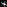
  <p align="center">Y Channel HOG</p>
</p>

<p align="center">
  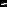
  <p align="center">Cr Channel HOG</p>
</p>

<p align="center">
  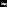
  <p align="center">Cb Channel HOG</p>
</p>


*HOG feature representations WITH car*:
<p align="center">
  
  <p align="center">Non car image in YCrCb Colorspace</p>
</p>

<p align="center">
  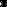
  <p align="center">Y Channel HOG</p>
</p>

<p align="center">
  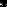
  <p align="center">Cr Channel HOG</p>
</p>

<p align="center">
  
  <p align="center">Cb Channel HOG</p>
</p>


The following methods are responsible for performing the HOG feature extraction:
* `ImageProcessor.extract_hog_features` - Line 97:
  * Extracts features for training phase


* `ImageProcessor.extract_hog_features_for_scoring` - Line 149:
  * Returns the response of the HOG function for the objection detection phase.

> Explain how you settled on your final choice of HOG parameters.

I tried various combinations of parameters and the following worked best:

* Spatial Size = 32,32
* Orientations = 9
  * 9 seems like a good number as it represents orientations around the 2D plane if it is successively divided.

* Pixels per cell = 8
* Cells per block = 2
* Color Space = YCrCb


* Each of the above feature sets were concatenated to form the feature vector for the image. The dimensions of the feature vector is below:

```
Dimensions of Feature Vector for image:
(1,8460)
```

> Describe how (and identify where in your code) you trained a classifier using your selected HOG features (and color features if you used them).

I experimented using a Linear Support Vector Machine Classifier to find a hyperplane of separation for the high-dimensional dataset created from the images. I chose the Linear Support Vector Machine Classifier because the problem presented a binary classification problem. Since the feature vectors in this problem are high-dimensional, SVMs work well in high dimensional spaces.

The following methods are responsible for performing the training phase with a Linear SVC:
* `VehicleDetectionPipeline.train` - Line 147


## Sliding Window Search

> Describe how (and identify where in your code) you implemented a sliding window search.  How did you decide what scales to search and how much to overlap windows?

I tried two approaches for the sliding window technique.

* I implemented a function `ImageProcessor.slide_window - Line 383` to return the coordinates of square windows of a specific window size. These coordinates were then used to create sub-images (which were resized to size 64x64) and features (hog, color-histograms, spatial-bins) were extracted from these "patches" and run through the classifier. If the classifier classified the window as having a car, the window would be appended to the list of candidate detections. This was then repeated for different window scale sizes ([256px, 192px, 128px, 64px]).

<p align="center">
  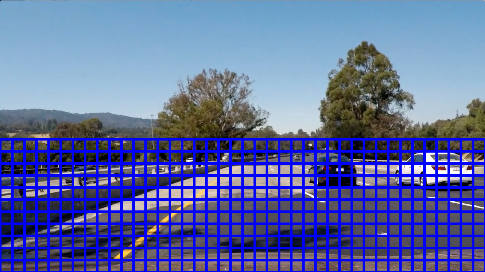
  <p align="center">Sliding windows with window size 64x64</p>
</p>

* Extracting the HOG features for every sub-image/image patch was very slow. As a result, a second approach was to find the HOG on the entire image and then select the corresponding elements in the HOG matrix for the specific image patch and append it with the other features extracted from the resized (64x64) image patch and run it through the classifier. For this implementation I used a base window size of 64x64 with scale factors of [0.75,1,1.5,2,3]. The result I obtained from a test image is as follows:

<p align="center">
  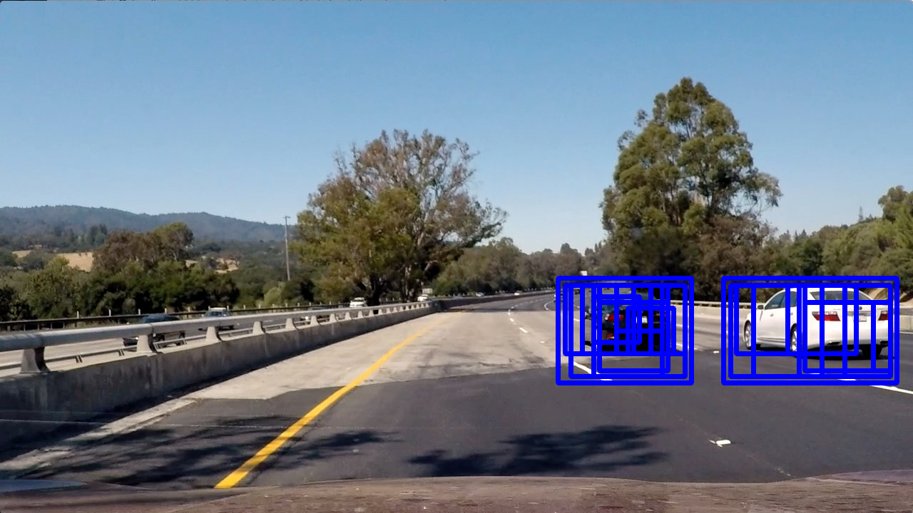
  <p align="center">Sliding windows with different window sizes</p>
</p>

To optimize the results of the classifier, I used the following approaches:
* Running the classifier agains sliding windows of multiple scales.
* Creating a heat map of detections and thresholding the number of overlapping detections.
* Using color-histograms, spatial-bins and HOG features.

## Result

> Show some examples of test images to demonstrate how your pipeline is working.  What did you do to optimize the performance of your classifier?

For the final version of the pipeline, I converted each frame of the image to the `YCrCb` color space and extracted HOG features for all 3-channels. In addition, I extracted features for image patches based on spatial binning of color intensities and histograms of color.

The results of the pipeline with bounding boxes drawn on the cars is as follows for a few different test images.

<p align="center">
  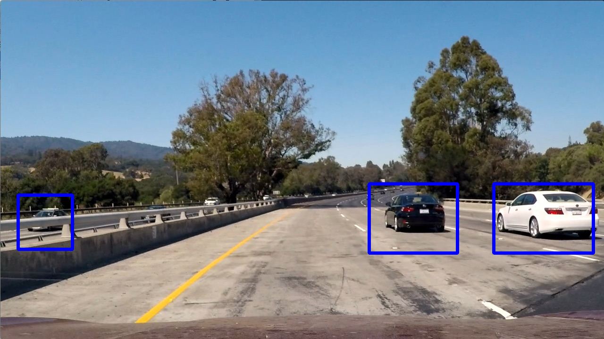
  <p align="center">Accurately finds the 3 cars in the image</p>
</p>

<p align="center">
  
  <p align="center">Does not find any false positives</p>
</p>

<p align="center">
  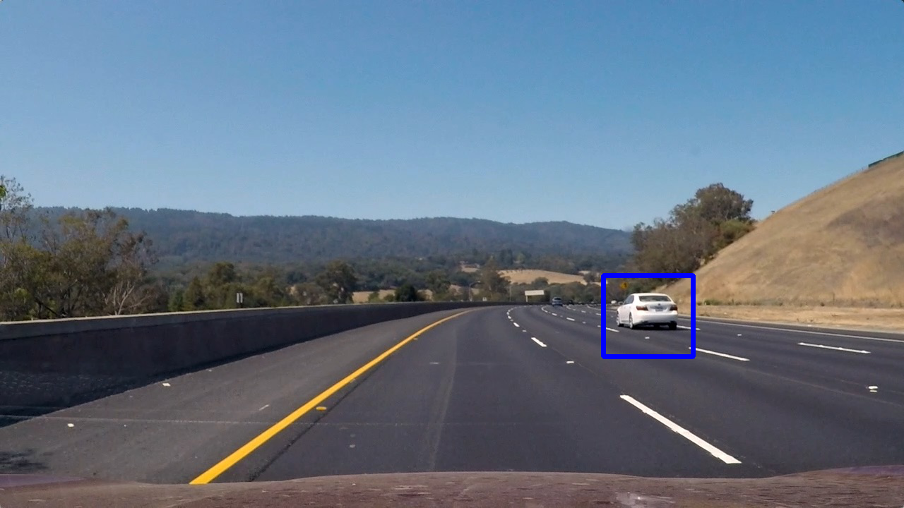
  <p align="center">Accurately finds the 1 car which is at a fair distance from the camera</p>
</p>

<p align="center">
  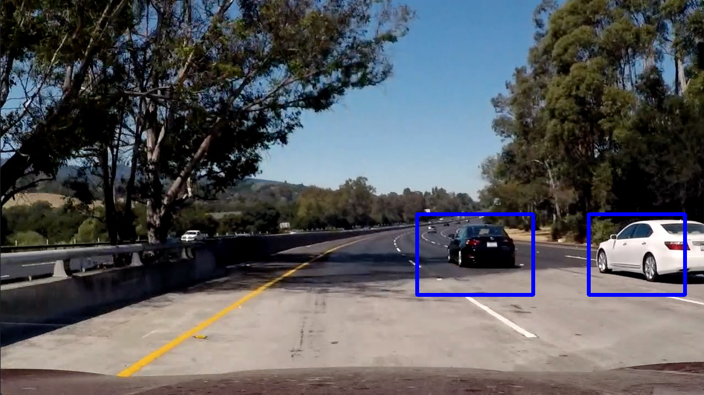
  <p align="center">Accurately finds both cars despite shadows from the trees</p>
</p>

---

## Video Implementation

> Provide a link to your final video output.  Your pipeline should perform reasonably well on the entire project video (somewhat wobbly or unstable bounding boxes are ok as long as you are identifying the vehicles most of the time with minimal false positives.)

Here's a [link to my video result](https://www.youtube.com/watch?v=CKhCfjDUAoo)

The link to the video in my project repository is at the relative path:
* `./output_image/project_video.mp4`

> Describe how (and identify where in your code) you implemented some kind of filter for false positives and some method for combining overlapping bounding boxes.

* I recorded the positions of positive detections in each frame of the video.  From the positive detections I created a heatmap and then thresholded that map to identify vehicle positions.  

* I then used `scipy.ndimage.measurements.label()` to identify individual blobs in the heatmap.  I then assumed each blob corresponded to a vehicle.  I constructed bounding boxes to cover the area of each blob detected.

Here's an example result showing the heatmap from a series of frames of video:

<p align="center">
  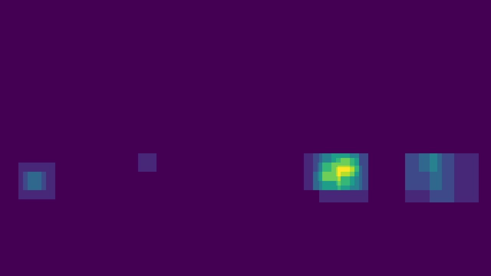
  <p align="center">Heat Map for the overlapping rectangles</p>
</p>

<p align="center">
  
  <p align="center">After thresholding, pixels in the heat map around the periphery of the detection are dropped - so the final bounding rectangle will not cover a large portion of the car</p>
</p>

* A problem here was that some of the overlapping rectangles that represented a True Positive detection, would only have an intersection within another window in a small subregion of the window, so the regions below the threshold were often being dropped. As a fix for this problem, for every group of overlapping windows, I reset the values of the pixels in the heat map to the maximum of the heat map value within the set of overlapping windows. This created a better heat map representation for the thresholding as parts of the windows in the heat map that belonged to the same car were not dropped due to low threshold values.

<p align="center">
  
  <p align="center">Heat Map for the overlapping rectangles and reset values within the rectangle to highest heat intensity</p>
</p>

<p align="center">
  
  <p align="center">After thresholding, pixels in the heat map around the periphery of the detection are NOT dropped and bounding box is clear</p>
</p>

The following methods are responsible for performing this heatmap and thresholding computation is as follows:
* `ImageProcessor.add_heat` - Line 324
* `ImageProcessor.apply_threshold` - Line 342

## Discussion

> Briefly discuss any problems / issues you faced in your implementation of this project.  Where will your pipeline likely fail?  What could you do to make it more robust?

This pipeline would likely fail in an environment where "real-time" detections are required, which is the case in self driving cars. For video of 50 seconds, the pipeline took 50 minutes (on my personal laptop) to run the classification and this would not work in a real world environment.

An obvious solution is to use a more powerful server with a powerful GPU to increase the raw speed of computation.
Additionally, it is possible to parallelize the feature extraction and classification process for the image patches for an image (since none of the patches depend on any of the other patches, and as a result, the features can be extracted and classified for each image patch independently of the others). This would result in a massive speed increase and make the object detection process as close to real time as possible.
